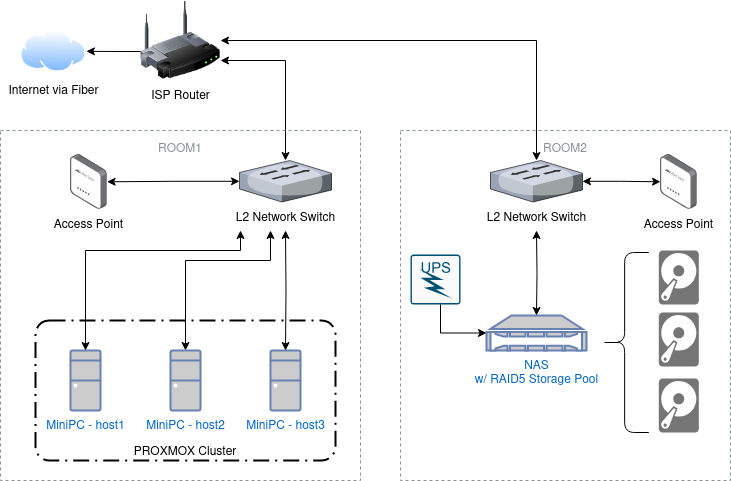
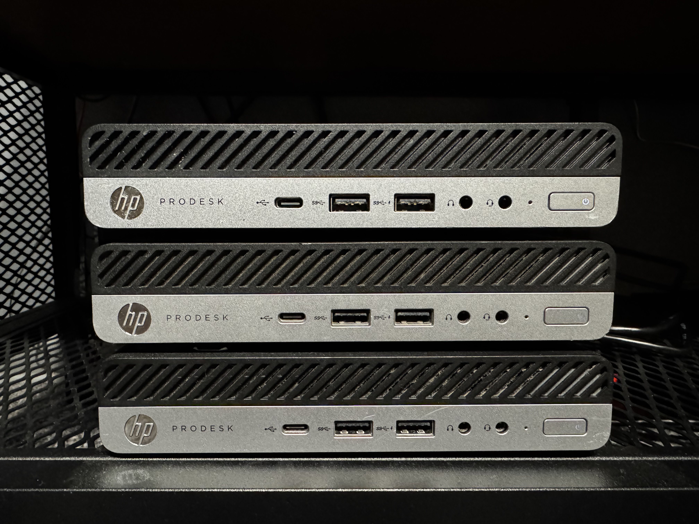

# K3s on Proxmox Homelab

Welcome to my homelab project! This repository documents the setup and configuration of a lightweight Kubernetes cluster using K3s, running on a Proxmox VE cluster. The homelab is built with 3 MINI PCs, forming a Proxmox cluster that hosts a K3s environment with 1 control plane and 2 worker nodes. This setup is designed for experimentation, learning, and running small-scale workloads in a home environment.

# Features

- [x] Automated K3S nodes provisioning on the Proxmox Cluster w/ Terraform
- [x] Automated K3S installation and configuration
- [x] Synology NAS integration with K3S cluster via NFS CSI Driver
- [ ] Homelab page w/ [Homepage](https://gethomepage.dev/)
- [x] GitOps with Flux for apps management
- [ ] Zabbix node for detailed monitoring of Proxmox cluster and k3s workloads
  
## Applications/Software used

- [x] NFS-CSI-DRIVER
- [x] MetalLB
- [ ] Homepage
- [ ] NGINX Ingressclass
- [ ] Zabbix

### TODO:

- replace proxmox provider user (currently root is used, as of issues with setting on access via ssh to the proxmox nodes for other user)
- move state to AWS S3 backend with state lock in S3 (as of latest Terraform version capabilities)

# Homelab Overview

This homelab runs on 3 MINI PCs clustered with Proxmox VE, forming the backbone of my K3s Kubernetes setup. These are all refurbished PCs, offering incredible value for their low cost!

## HLD

My Infrastructure is spread across 3 different areas.

1. ISP Connection
    - Internet via Fiber terminates at the ISP router, located in a central area (e.g., a living room or utility closet).
    - The ISP router acts as the primary gateway for your network.
2. Room 1
    - Ethernet Cable runs from the ISP router to Room 1.
    - Access Point (AP) provides wireless coverage within Room 1 and nearby areas.
    - MiniPC Cluster (Host1, Host2, Host3):
        - Each MiniPC is connected via Ethernet (via a switch) to the network.
        - Often used as Proxmox cluster running mainly k3s cluster and some side supportive VMs.
3. Room 2
    - Ethernet Cable also runs from the ISP router to Room 2.
    - Access Point (AP) for wireless coverage within Room 2 and nearby areas.
    - UPS to protect NAS from power outages.
    - NAS (Network Attached Storage) with a RAID5 storage pool for data redundancy, backup, and NFS for k3s workloads (supported with nfs-csi storage class).
    - The NAS is typically connected to the UPS for clean shutdowns in case of a power failure.

## Hardware

Three Mini PCs: **HP ProDesk 600 G4** clustered with Proxmox VE.

Which are all equiped with:

| Component | Specification | Notes                                     |
|-----------|---------------|-------------------------------------------|
| CPU       | I5-8500T      | optimized for very low energy consumption |
| RAM       | 16GB          |                                           |
| STORAGE   | 256GB SSD     |                                           |

The cluster offers a total of 18 CPU cores and approximately 48GB of RAM, providing substantial computing power to efficiently run k3s workloads for homelab purposes.

## Proxmox VE

TBD

# Access

TBD

## Assumptions

- Proxmox VE is already installed on the servers/PCs
- SSH connection towards proxmox is setup:
    - SSH-Key is added to the keychain on your PC
    - User is created on the proxmox host where the VM is supposed to be deployed
    - Reference [docs](https://registry.terraform.io/providers/bpg/proxmox/latest/docs#ssh-user) on how to set up SSH user for proxmox SSH connection\
- Flux CLI is installed on your machine

### Troubleshooting Terraform

If `terraform plan` fails with a 404 error for the Ubuntu image URL:
- Verify the `ubuntu_image_url` variable points to a valid image (e.g., `https://cloud-images.ubuntu.com/noble/current/noble-server-cloudimg-amd64.img`).
- Alternatively, manually upload the image to each Proxmox node’s `local` datastore and update the `file_id` in the VM resource to `local:iso/noble-server-cloudimg-amd64.img`.
